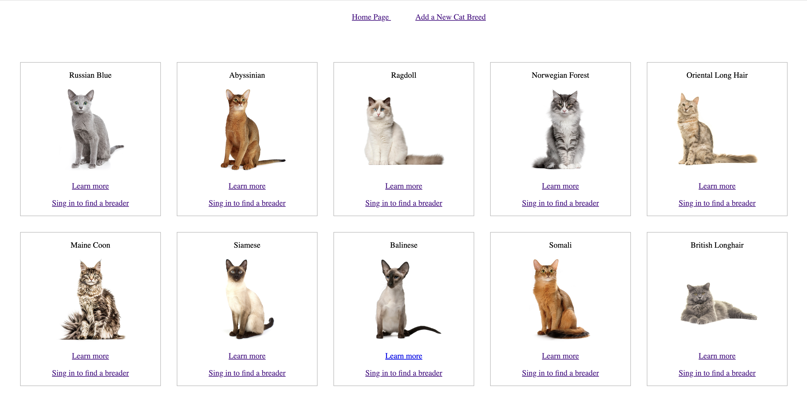
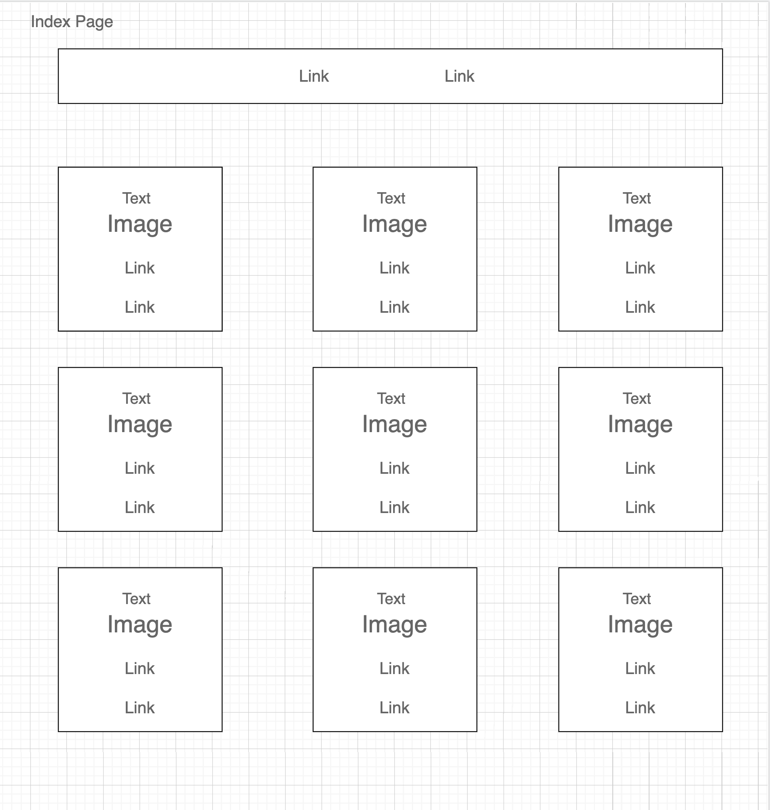
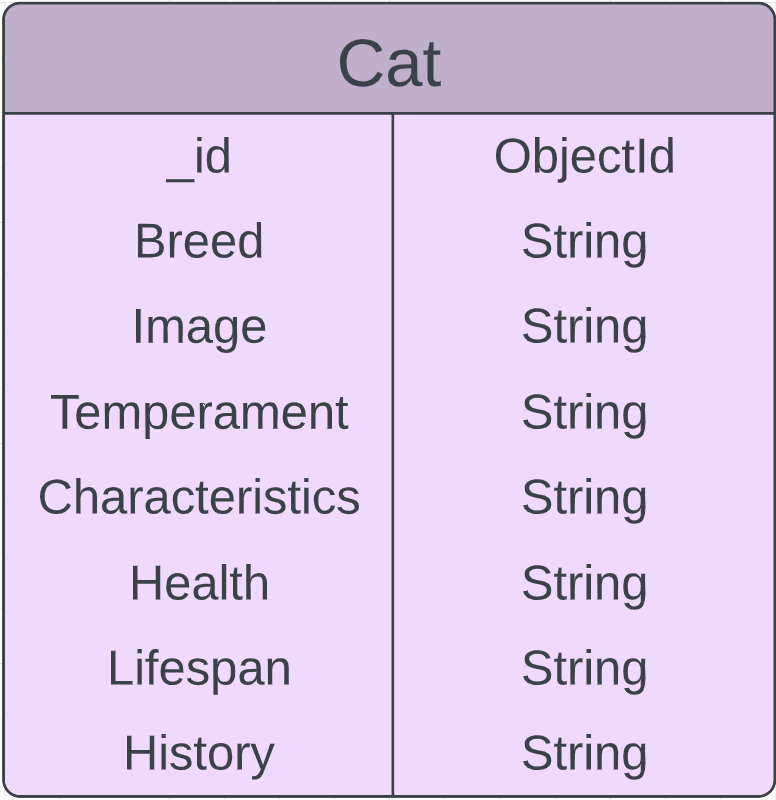

# Cat breeds website 

### Resourses ###

Website: http://localhost:3008/cats

Trello: https://trello.com/b/gadqSrZq/cat-breeds-website

  

### Restful Routes ###

|#| Action | URL | HTTP Verb| JSX view filename| Mongoose method |
|-|-|-|-|-|-|
| 1 | Index |/cats/| GET | Index.jsx | Cat.find() |
| 2 | Show | /cats/:id | GET | Show.jsx | Cat.findOne or Cat.findById |
| 3 | New | /cats/new | GET | New.jsx | none |
| 4 | Create | /cats/ | POST | none | Cat.create(req.body) |
| 5 | Edit | /cats/:id/edit | GET | Edit.jsx | Cat.findOne or Cat.findById |
| 6 | Update | /cats/:id | PUT/PATCH | none | Cat.findByIdAndUpdate or Cat.findOneAndUpdate|
| 7 | Delete | /cats/:id | DELETE  | none | Cat.findByIdAndDelete or Cat.findByIdAndRemove|

### Technologies used: ###
CRUD, MVC, REST, INDUCES, JavaScript, JSX, React, Express, Mongoose, MongoDB

 

### Wireframes ###
 

 

### ERD ###
 

 

### Next Steps ###

1. Add Authentication for the admin to be able to create new breed, edit existent and delete
2. Add Authentication for users to be able to create account and see the breeder contacts 
3. Add Authentication and Authorization for breeders to be able to add their contacts  